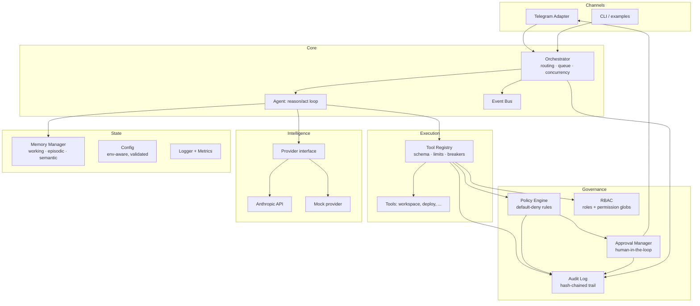

# Enterprise AGI Runtime — Architecture

This repository now contains a governed, enterprise-ready agentic AI runtime
(`agi/`) layered on top of the original Telegram + Cursor bot. A note on
naming: "AGI" here means an **AGI-style architecture** — a general, governed,
multi-agent system — not a claim of artificial general intelligence. What
makes it enterprise-ready is not the intelligence of any single model, but the
control plane wrapped around every action an agent takes.

## Design principles

1. **Default-deny governance.** No agent action executes unless a policy rule
   explicitly allows it. Unknown = denied.
2. **No privileged paths.** Agents can only act through the governed
   `ToolRegistry`; there is no side door around RBAC, policy, or audit.
3. **Human-in-the-loop for high risk.** High-risk actions pause for operator
   approval (e.g. via Telegram `/approve <id>`); critical-risk actions are
   never executed autonomously.
4. **Everything is auditable.** Every decision and execution lands in a
   hash-chained, tamper-evident audit trail.
5. **Fail predictably.** Retries, circuit breakers, rate limits and bounded
   queues turn downstream failure into degradation, not cascade.
6. **Swappable intelligence.** The model behind the agents is a `Provider`
   interface — Anthropic API, a scripted mock for tests/offline dev, or any
   future backend.

## Component map



## The action pipeline

Every tool call an agent attempts flows through six gates, in order:

| # | Gate | Failure mode |
|---|------|--------------|
| 1 | Argument schema validation | `INVALID_ARGS` |
| 2 | RBAC (`tool:<name>` permission for the agent's role) | `RBAC_DENIED` |
| 3 | Policy evaluation (default-deny rule engine) | `POLICY_DENIED` |
| 4 | Human approval (when policy says `require_approval`) | `APPROVAL_DENIED` / timeout |
| 5 | Rate limiter + circuit breaker + retry | `RATE_LIMITED` / `CIRCUIT_OPEN` |
| 6 | Audit + metrics recording | never skipped, success or failure |

A denied action does not kill the agent: the denial is returned as an
observation, and the agent adapts or finishes with what it has.

## Module reference

| Module | Purpose |
|--------|---------|
| `agi/index.js` | `createRuntime()` factory that wires everything together |
| `agi/core/agent.js` | JSON-protocol reason/act loop with step budget |
| `agi/core/orchestrator.js` | Capability routing, FIFO queue, bounded concurrency, task lifecycle events |
| `agi/core/event-bus.js` | Wildcard pub/sub decoupling channels from core |
| `agi/governance/policy-engine.js` | Declarative rules: glob/array/predicate matching, priority + most-restrictive-wins |
| `agi/governance/default-policies.js` | Baseline pack: critical=deny, high=approval, secrets-in-args=deny |
| `agi/governance/rbac.js` | Roles, permission globs, inheritance (cycle-safe) |
| `agi/governance/audit-log.js` | SHA-256 hash-chained entries, JSONL persistence, `verify()` |
| `agi/governance/approval-manager.js` | Pending-approval queue with timeout-to-deny |
| `agi/tools/tool-registry.js` | The single governed gate for all agent actions |
| `agi/memory/memory-manager.js` | Working (bounded window), episodic (JSONL), semantic (scored recall) |
| `agi/providers/index.js` | `Provider` interface, `AnthropicProvider`, `MockProvider` |
| `agi/resilience/index.js` | `retry`, `CircuitBreaker`, `RateLimiter` (injectable clocks, fully testable) |
| `agi/observability/logger.js` | Structured JSON logs with deep secret redaction |
| `agi/observability/metrics.js` | Counters, gauges, histograms, `snapshot()` |
| `agi/config/config.js` | Defaults ← overrides ← env; fail-fast validation; secrets only from env |
| `agi/adapters/telegram-adapter.js` | Telegram as a channel: tasks in, results + approval prompts out |
| `agi/routing/self-healing-router.js` | Dijkstra-based deterministic recovery; LLM escalation only when no path remains; attention triage |
| `agi/monitoring/companion-runtime.js` | VIGIL-style maintenance plane: appraisals, drift detection, RBT diagnostics, remediation proposals |
| `agi/verification/property-testing.js` | Property-based testing: invariant falsification with shrinking counterexamples |
| `agi/verification/mutation-testing.js` | Mutation-guided suite scoring: semantic mutants, kill-rate thresholds |
| `agi/evolution/evolution-engine.js` | Guarded self-evolution: threat scan → evaluation → policy/approval → hash-chained lineage + rollback |
| `agi/security/execution-boundaries.js` | Tool/loop timeouts, default-deny egress allowlist, workspace path confinement |

See [SELF_EVOLUTION.md](SELF_EVOLUTION.md) for the autonomy layer's full design, threat model, and integration seams.

## Enterprise readiness checklist

| Concern | Where it's addressed |
|---------|---------------------|
| Access control | RBAC with role inheritance; per-tool permissions |
| Policy & compliance | Default-deny policy engine; custom rule packs per deployment |
| Human oversight | Approval workflow with timeout-to-deny; operator allowlist in Telegram |
| Auditability | Tamper-evident hash chain; queryable; JSONL retention via `AGI_AUDIT_FILE` |
| Secrets hygiene | Secrets only via env vars; log redaction; policy blocks secrets in tool args |
| Reliability | Retry w/ backoff, circuit breakers per tool, token-bucket rate limits |
| Backpressure | Bounded task queue + bounded concurrency (`AGI_MAX_CONCURRENT`, `AGI_MAX_QUEUE_SIZE`) |
| Observability | Structured JSON logs, metrics snapshots, `/agihealth`, `runtime.health()` |
| Runaway control | Per-agent step budgets (`AGI_AGENT_MAX_STEPS`); rate limits per tool |
| Testability | Zero-dependency framework; injectable clocks/providers; 39 unit/integration tests |
| Configurability | Layered config with env overrides and fail-fast validation |

## Configuration

Everything is configurable via `createRuntime({...})` overrides or environment
variables:

| Env var | Meaning | Default |
|---------|---------|---------|
| `AGI_LOG_LEVEL` | debug / info / warn / error | `info` |
| `AGI_MAX_CONCURRENT` | parallel task limit | `2` |
| `AGI_MAX_QUEUE_SIZE` | max queued tasks before rejection | `100` |
| `AGI_AGENT_MAX_STEPS` | reason/act iterations per task | `8` |
| `AGI_APPROVAL_TIMEOUT_MS` | auto-deny window for approvals | `300000` |
| `AGI_AUDIT_FILE` | JSONL audit persistence path | in-memory only |
| `AGI_EPISODIC_FILE` | JSONL episodic-memory path | in-memory only |
| `AGI_PROVIDER` | `mock` or `anthropic` | `mock` |
| `AGI_MODEL` | model id for the Anthropic provider | `claude-sonnet-5` |
| `ANTHROPIC_API_KEY` | required when `AGI_PROVIDER=anthropic` | — |

## Quick start

```bash
npm test          # 39 tests, no dependencies needed
npm run demo      # offline end-to-end demo with visible governance

# with a real model:
AGI_PROVIDER=anthropic ANTHROPIC_API_KEY=sk-... node examples/demo.js
```

Minimal embedding:

```js
const { createRuntime } = require('./agi');

const runtime = createRuntime({ provider: { kind: 'anthropic' } });
runtime.rbac.defineRole('builder', ['tool:workspace.*']);
runtime.tools.register({
    name: 'workspace.list',
    description: 'List workspace files',
    riskLevel: 'low',
    handler: async () => ({ files: [] })
});
runtime.createAgent({ id: 'builder-1', role: 'builder', capabilities: ['build'] });

const { done } = runtime.orchestrator.submitTask({
    description: 'Summarize the workspace',
    capability: 'build'
});
console.log(await done);
```

Wiring into the existing Telegram bot (after password auth, inside the
message handler):

```js
const { createRuntime } = require('./agi');
const { TelegramAdapter } = require('./agi/adapters/telegram-adapter');

const runtime = createRuntime({ provider: { kind: 'anthropic' } });
const adapter = new TelegramAdapter({
    bot, runtime,
    capability: 'build',
    operatorChatIds: [YOUR_CHAT_ID]
});

// inside bot.on('message', ...) once the user is authenticated:
const consumed = await adapter.handleMessage(msg);
if (!consumed) { /* fall through to the legacy Cursor-automation path */ }
```

## Scaling path

The runtime is single-process by design (matching the bot it extends), with
clean seams for scaling out:

- **Queue**: `Orchestrator`'s in-memory FIFO can be swapped for
  Redis/SQS by replacing `submitTask`/`pump` while keeping the task
  state machine.
- **Memory**: `SemanticMemory.recall()` is deliberately a token-overlap
  stand-in — swap for an embedding store (pgvector, Pinecone) behind the same
  `store`/`recall` interface.
- **Audit**: point `AGI_AUDIT_FILE` at an append-only volume today; swap
  `fs.appendFileSync` for a WORM store or ledger DB for regulated workloads.
- **Providers**: add providers (Bedrock, Vertex, local) by implementing
  `Provider.complete()`.
